# geometry Models

署名：Hence

从图形中发现关系，在推理中理解几何

## 第一章 夹半角

### 四种常见构型

四图中的 ABCD 均为正方形，各动点在指定边的内部。识别时先找等长邻边和直角，再看 45°在顶点还是交点。原图与辅助线图并排，辅助线用虚线表示。

#### 图 A 顶点夹半角：完整证明

**条件与结论** E∈BC、F∈CD，∠EAF＝45°。则 EF＝BE＋DF；反过来，EF＝BE＋DF 也能推出 ∠EAF＝45°。

**怎么想** 把 BE 搬到 CD 的延长线上，使 BE＋DF 成为一条线段，再用半角证明这条线段等于 EF。

**规范解答** 延长 CD 至 G，使 DG＝BE，连接 AG。点序为 C、F、D、G。这相当于把 △ABE 绕 A 逆时针旋转 90°到 △ADG。

（1）在 △ABE 与 △ADG 中，AB＝AD、BE＝DG、∠ABE＝∠ADG＝90°，所以 △ABE≅△ADG（SAS）。于是 AE＝AG，∠BAE＝∠DAG。

（2）因为 ∠BAE＋∠EAD＝90°，所以 ∠EAG＝∠EAD＋∠DAG＝90°。AF 在 ∠EAG 内，而 ∠EAF＝45°，故 ∠FAG＝45°。由 AE＝AG、AF 公共、∠EAF＝∠GAF，得 △EAF≅△GAF（SAS），因此 EF＝FG。

（3）由 F、D、G 的点序，EF＝FG＝FD＋DG＝DF＋BE，结论成立。

**逆命题** 仍作 DG＝BE，第一组全等仍给出 AE＝AG、∠EAG＝90°。若 EF＝BE＋DF，则 EF＝FG。结合 AF 公共，△EAF≅△GAF（SSS），所以 ∠EAF＝∠GAF。两角相加为 90°，故 ∠EAF＝45°。

**相应结论** 设 AB＝s、BE＝e、DF＝f，其中 0＜e,f＜s。

- 定周长：EF＝e＋f → △CEF 的周长＝(s−e)＋(s−f)＋(e＋f)＝2s。
- 长度关系：在 Rt△CEF 中，CE＝s−e、CF＝s−f，因此 (s−e)²＋(s−f)²＝(e＋f)²。
- 已知 AB、BE：由上式解得 DF＝s(s−e)/(s＋e)，CF＝s−DF＝2se/(s＋e)。

**方法点睛** 等长邻边提供第一次全等，半角提供第二次全等，最后按点序写线段和。

#### 图 B 交叉角：平行转移

E∈BC、F∈AB，AE 与 CF 交于 P，∠EPC＝45°。过 A 作 AG∥CF，交 CD 于 G，并连接 EG。

AG∥CF → ∠EAG＝∠EPC＝45°。

AD＝CB、∠ADG＝∠CBF＝90°、∠DAG＝∠BCF → △ADG≅△CBF（ASA） → DG＝BF。

转为图 A → EG＝BE＋DG＝BE＋BF。

若 AB＝s、BE＝e、BF＝f，则由图 A 的勾股等式化简得 **ef＋s(e＋f)＝s²**。

#### 图 C 交叉角：垂直转移

E∈BC、F∈AD，AE 与 BF 交于 P，∠APF＝45°。过 A 作 AG⊥BF，交 CD 于 G，并连接 EG。

AG⊥BF、∠APF＝45° → ∠EAG＝90°−45°＝45°。

AD＝BA、∠ADG＝∠BAF＝90°、∠DAG＝∠ABF（两角的两边分别垂直） → △ADG≅△BAF（ASA） → DG＝AF。

转为图 A → EG＝BE＋DG＝BE＋AF。

若 AB＝s、BE＝e、AF＝f，则 **ef＋s(e＋f)＝s²**。

#### 图 D 两条线同时平移

E∈AD、F∈BC、M∈AB、N∈CD，EF 与 MN 交于 P，∠FPN＝45°。按图示位置，BF＞AE、DN＞AM。过 A 作 AT∥EF、AU∥MN，分别交 BC、CD 于 T、U，并连接 TU。

AE∥TF、AT∥EF → AEFT 为平行四边形 → TF＝AE → BT＝BF−AE。

AM∥NU、AU∥MN → AMNU 为平行四边形 → NU＝AM → DU＝DN−AM。

AT∥PF、AU∥PN → ∠TAU＝45° → 转为图 A → **TU＝BT＋DU＝(BF−AE)＋(DN−AM)**。

若 AB＝s、BT＝e、DU＝f，仍有 ef＋s(e＋f)＝s²。点序改变时，要重新判断射线方向及线段加减。

### 题目区

#### 正方形内的旋转

**题 1 四个条件相互推导**

正方形 ABCD 中，M、N 分别在 AD、CD 的内部。证明下列四个条件彼此等价：（1） ∠MBN＝45°；（2） MN＝AM＋CN；（3） ∠AMB＝∠BMN；（4） ∠BNM＝∠BNC。

**题 2 从等角恢复半角**

正方形 ABCD 中，M∈AD、N∈CD，∠BMN＝∠MBC，AB＝9，DM＝6，求 CN。

入手提示：由 AD∥BC，把已知等角转写为题 1 中的一个条件。

**题 3 对角线上的垂直与等长**

正方形 ABCD 中，E 为对角线 AC 内部的一点，N 在 CD 上，且 BE⊥EN。证明 BE＝EN。

入手提示：连接 DE。关于对角线 AC 对称的两个顶点是哪两个？

#### 从三角形补出模型

**例题 4 同一道题的三种构造**

△ABC 中，D 为 BC 内部的一点，AD⊥BC，∠BAC＝45°，BD＝3，AD＝6，求 CD。

**怎么想** 设 CD＝x。∠BAD、∠DAC 都小于 45°，故 BD、CD 都小于 AD，即 0＜x＜6。三种构造都把原图转为一个可用勾股定理的直角三角形。

**规范解答 方法一 补正方形与旋转** 在 AB 所在的一侧补正方形 ADMN，将 C 绕 A 顺时针旋转 90°到 G。于是 AG＝AC、NG＝x、MG＝6−x。AB 平分 ∠CAG，所以 △CAB≅△GAB（SAS） → BG＝BC＝3＋x；又 BM＝6−3＝3。Rt△BMG 给出 (3＋x)²＝3²＋(6−x)² → 18x＝36 → x＝2。

**方法二 两次翻折** 将 D 分别关于 AB、AC 对称到 E₁、F₁，延长 E₁B、F₁C 交于 P。AE₁＝AF₁＝6、BE₁＝3、CF₁＝x，两条翻折后的垂线与 ∠E₁AF₁＝2∠BAC＝90°共同构成正方形 AE₁PF₁。因此 PB＝3、PC＝6−x。Rt△BPC 给出 (3＋x)²＝3²＋(6−x)² → x＝2。

**方法三 延长构造** 在 BC 两侧的延长线上取 E、F，使 DE＝DF＝AD＝6；△AEF 为等腰直角三角形。过 A 作 AH∥BC、过 F 作 FH⊥BC，交于 H；将 B 绕 A 逆时针旋转 90°到 G，则 G∈FH、HG＝BD＝3、FG＝6−3＝3。AC 平分 ∠BAG，故 △BAC≅△GAC（SAS） → CG＝BC＝3＋x。Rt△CFG 给出 (3＋x)²＝3²＋(6−x)² → x＝2。

因此 **CD＝2**。

**方法点睛** 三种添线方法不同，最后都得到同一组直角三角形的边长：3、6−x、3＋x。

#### 矩形与交叉角

**题 5 矩形中截出正方形**

矩形 ABCD 中，AD＝6，AB＝12，F∈CD，DF＝3，E∈BC，∠EAF＝45°，求 BE。

**题 6 把交叉角搬到顶点**

直角三角形 ABC 中，∠C＝90°，AC＝6，BC＝8，D 是 AC 的中点，E∈BC，BD 与 AE 交于 F。若 ∠BFE＝45°，求 CE。

**题 7 相等的两段补足旋转**

矩形 ABCD 中，E、F 分别在 BC、CD 的内部，CE＝CF，DF＝3，BE＝4，∠EAF＝45°，求 AB。

#### 位置变化与分类讨论

**题 8 从线段和到线段差**

四边形 ABCD 的四条边相等，四个角都是直角，连接 AM、AN、MN。

（1）M、N 分别在 BC、CD 的内部，∠MAN＝45°。证明 MN＝BM＋DN。

（2）M 在 BC 向 C 外的延长线上，N 在 CD 向 D 外的延长线上，仍有 ∠MAN＝45°。判断 BM、DN、MN 的数量关系，并证明。

入手提示：两问采用同一次旋转，再观察三个共线点的顺序。

**题 9 一个条件对应两种构型**

△ABC 中，D 在 BC 上，∠ABC＝45°，∠CAD＝45°，BD＝4，BC＝9，求 AB 的长。

入手提示：过 A 作 AH⊥BC，垂足 H 在直线 BC 上。先利用 ∠B＝45°，再讨论 H 与 D 的位置。

### 集中解析

#### 题 1 解析

**怎么想** 用旋转连接半角与线段和，用垂线连接等角与等距。

四条件关系图：（2）线段和 ⇔（1）半角 ⇔（3）M 处等角 ⇔（4）N 处等角。

**规范解答** 将 M 绕 B 顺时针旋转 90°到 P，得 CP＝AM、BP＝BM、∠MBP＝90°；另作 BQ⊥MN。排版分成旋转图与垂线图。

旋转：半角与线段和相互推出。

（1）使 BN 平分 ∠MBP → △MBN≅△PBN（SAS）→ MN＝PN＝AM＋CN（2）；∠BMN＝∠BPN＝∠AMB（3）；∠BNM＝∠BNP＝∠BNC（4）。

反过来，（2）→ MN＝PN；BM＝BP、BN 公共 → △MBN≅△PBN（SSS）→ ∠MBN＝∠MBP/2＝45°（1）。

垂线：两个等角条件相互推出。B 在 ∠AMN、∠CNM 内，角平分线可用到两边的等距来判断。

（3）→ Rt△BQM≅Rt△BAM（公共斜边 BM 与 M 处相等的锐角）→ BQ＝BA＝BC →（4）。

（4）→ BQ＝BC＝BA → BM 平分 ∠AMN →（3）。

等角：恢复顶点处的半角。令 α＝∠ABM、β＝∠NBC、θ＝∠MBN。由（3）（4），△BMN 的内角和给出 θ＝α＋β；∠ABC 给出 θ＋α＋β＝90° → θ＝45°（1）。四个条件彼此等价。

**方法点睛** 旋转看全等，垂线看等距；最后用三角形内角和恢复半角。

#### 题 2 解析

**怎么想** 题面没有写 45°，但已给出题 1 的等价条件。

**规范解答** 因 AD∥BC，∠AMB＝∠MBC。已知 ∠BMN＝∠MBC，故 ∠AMB＝∠BMN，由题 1，∠MBN＝45°且 MN＝AM＋CN。AM＝9−6＝3。设 CN＝x，则 DN＝9−x，MN＝3＋x。在 Rt△MDN 中，6²＋(9−x)²＝(3＋x)²，解得 x＝9/2。所以 CN＝9/2。

**方法点睛** 没有出现半角数值时，先找模型的等价条件。

#### 题 3 解析

**怎么想** E 在正方形对角线上，天然具有对称性；先把 BE 变成 DE，再用垂直关系证明 DE＝EN。

**规范解答** 连接 DE。正方形关于 AC 对称，B 与 D 互为对称点，E 位于对称轴上，所以 BE＝DE、∠ABE＝∠ADE。由 BE⊥EN、BC⊥ND，且按图中射线方向，有 ∠DNE＝∠EBC。又 ∠EDN＝90°−∠ADE＝90°−∠ABE＝∠EBC，所以 ∠EDN＝∠DNE，DE＝EN。因此 BE＝EN。

**方法点睛** 对角线给出等长，垂直给出等角，合起来构成等腰三角形。

#### 题 5 解析

**怎么想** 长边是短边的两倍，可以截出一个正方形，先在小图中求长，再回到原矩形。

**规范解答** 取 AB 中点 M，作 MQ∥AD，交 DC 于 Q，AE 与 MQ 交于 N。AMQD 是边长 6 的正方形，DQ＝6、FQ＝3。设 MN＝x，图 A 给出 FN＝DF＋MN＝3＋x，而 NQ＝6−x。在 Rt△FQN 中，(3＋x)²＝3²＋(6−x)²，得 x＝2。△AMN∽△ABE，AB/AM＝2，因此 BE＝2MN＝4。

**方法点睛** 矩形先截正方形，局部模型求出后再用相似放回整体。

#### 题 6 解析

**怎么想** 交点处的 45°可通过一条垂线搬到 A，随后变成例题 4 的底边高模型。

**规范解答** 过 A 作 AG⊥BD，交 BC 向 C 外的延长线于 G。∠BFE＝45°，所以按 G、C、E 的点序，∠GAE＝45°。Rt△ACG 与 Rt△BCD 相似，CG/AC＝CD/BC＝3/8，故 CG＝9/4。设 CE＝x。在 △AGE 中，AC 为高，AC＝6、CG＝9/4。按例题 4 的延长旋转构造，(9/4＋x)²＝(6−9/4)²＋(6−x)²，展开并合并同类项，得 x＝30/11。所以 CE＝30/11。

**方法点睛** 交叉角优先用平行或垂直转移，再进入熟悉的模型。

#### 题 7 解析

**怎么想** 先用旋转得到相等的斜边，再从图上读出“一差一和”，用勾股定理求值。

**规范解答** 设 CE＝CF＝x，则 AB＝x＋3、AD＝x＋4。将 E 绕 A 逆时针旋转 90°到 G。作 GH∥AD，交 CD 的延长线于 H；作 GT⊥AD，垂足为 T。辅助图标明横、竖两段的长度。

旋转全等：AE＝AG、AF 公共、∠EAF＝∠GAF＝45° → △EAF≅△GAF（SAS）→ EF＝GF。

读图：旋转给出 AT＝AB＝x＋3、GT＝BE＝4；GTDH 为矩形。

GH＝TD＝AD−AT＝(x＋4)−(x＋3)＝1；FH＝FD＋DH＝3＋4＝7。

勾股：EF²＝CE²＋CF²＝2x²；GF²＝GH²＋FH²＝1²＋7²＝50。

EF＝GF → 2x²＝50；x＞0 → x＝5 → **AB＝x＋3＝8**。

**方法点睛** 相等的 CE、CF 让横向的 x 抵消，竖向直接相加。

#### 题 8 解析

**怎么想** 辅助线完全相同，位置改变只影响共线线段的加减。

**规范解答** （1）将 M 绕 A 逆时针旋转 90°到 P，则 P 在 CD 向 D 外的延长线上，DP＝BM、AP＝AM。∠MAP＝90°，AN 平分此角，所以 △MAN≅△PAN（SAS），MN＝PN。由 P、D、N 的点序，PN＝PD＋DN＝BM＋DN。

（2）同样旋转 M 得到 P。此时 P、N、D、C 按此顺序共线。∠MAP＝90°、∠MAN＝45°，AN 仍在该直角内部并平分它，所以 △MAN≅△PAN，MN＝PN。由点序，PN＝PD−ND＝BM−DN，即 BM＝MN＋DN。这里 BM＞DN，不能把两条正长度的和照搬到外部构型。

**方法点睛** 先证明全等，再根据点序写加法或减法。

#### 题 9 解析

**怎么想** 旋转后得到一个 3∶4∶5 的直角三角形，再按 K 在 C 的哪一侧分两种情况。

**规范解答** 作 AH⊥BC。∠B＝45°使 H 在 B 向 C 的射线上，设 AH＝BH＝t＞0。将 △ABD 绕 A 逆时针旋转 90°到 △AKG，B、D 分别对应 K、G。两幅图分别标出两种位置及 3、4、5 三条边。

旋转：△ABH 为等腰直角三角形 → BH＝HK＝t → BK＝2t；BD 绕 A 旋转 90°到 KG → KG⊥BC、KG＝BD＝4。

半角全等：AD＝AG、AC 公共、∠DAC＝∠CAG＝45° → △DAC≅△GAC（SAS）→ GC＝DC＝5。

勾股：Rt△GKC → CK²＝GC²−KG²＝5²−4²＝9 → CK＝3。

分类：由 BK＝2t、AB＝√2·t，分为两条箭头路径：

- K 在 C 左侧 → BK＝9−3＝6 → t＝3 → **AB＝3√2**。
- K 在 C 右侧 → BK＝9＋3＝12 → t＝6 → **AB＝6√2**。

两种构型都满足原条件；若限定 H 在 DC 内部，才只保留 6√2。

**方法点睛** 先用旋转固定 CK＝3，再由点序决定 BK 用加法还是减法。

### 模型总结与拓展

#### 方法卡片

长什么样：同一个顶点处有两条等长邻边夹 90°，其中另两条射线夹 45°；45°也可能藏在两线交点处。

怎么想：先把 45°搬到合适的顶点，再把分散的长度搬到同一直线上。

几步模板：确认等长与角度条件 → 转移交叉角或补出正方形 → 旋转或翻折得到全等 → 按点序写线段和差 → 用勾股或相似求值。

易错警示：矩形缺少邻边相等的条件，必须先截形或另作构造；点在延长线上时，需要重判线段加减。

常用添线：旋转适合等长邻边与半角；翻折适合半角顶点到同一直线有垂线；延长适合复制已知高，构造等腰直角三角形；矩形优先寻找局部正方形。

#### 拓展一 四个条件与定高

在题 1 的内部构型中，四个条件任一成立，则 B 到 MN 的距离等于正方形边长 s。证明见题 1：从角平分关系得两组直角三角形全等。因此 S△BMN＝s·MN/2。这是由斜边长求面积的快捷方法。

#### 拓展二 定周长与乘积关系

仍用题 1 的构型，设 AM＝m、CN＝n、正方形边长为 s。由 MN＝m＋n，△DMN 的周长为 (s−m)＋(s−n)＋(m＋n)＝2s。

在 Rt△DMN 中，(s−m)²＋(s−n)²＝(m＋n)²，整理得 mn＋s(m＋n)＝s²，即 (s＋m)(s＋n)＝2s²。已知 m 可求 n＝s(s−m)/(s＋m)。该公式也可由题 1 逆向恢复半角，但使用时必须满足 0＜m,n＜s。

再设 L＝MN＝m＋n。由 mn＝s²−sL＞0，可得 L＜s；由 (m−n)²＝(L＋2s)²−8s²≥0，得到 L≥2(√2−1)s。等号恰在 m＝n＝(√2−1)s 时成立。

#### 拓展三 底边高型的通式

△ABC 中，AD⊥BC，D 在 BC 内部，∠BAC＝45°。设 AD＝h、BD＝p、CD＝q，则 p,q＞0，且 p,q＜h。按例题 4 的延长与旋转构造，(p＋q)²＝(h−p)²＋(h−q)²，整理为 pq＋h(p＋q)＝h²，故 q＝h(h−p)/(h＋p)。反之，若 h,p,q＞0 且该等式成立，同一构造可由边长恢复 45°。

例如例题 4 中 h＝6、p＝3，得 q＝2；题 6 转化后 h＝6、p＝9/4，得 q＝30/11。这里 D 必须在底边内部，不能把它直接套到垂足在外的题 9 第一种构型。

#### 拓展四 怎样判断应写和还是差

题 8 的两问都先证明 MN＝PN，再按点序表达 PN。P、D、N 时用 PD＋DN；P、N、D 时用 PD−DN。解题时可以先写“目标线段＝辅助线段”，最后一步才换成题目中给出的长度。这样即使把图形转动、翻转，或把点移到延长线上，也不容易误套公式。

顶点夹半角的长度公式及证明已放在开头图 A 中：BE＝e 时，DF＝s(s−e)/(s＋e)、CF＝2se/(s＋e)，其中 0＜e＜s。

### 易错提醒

- 矩形没有 AB＝AD，不能直接套正方形的线段和。
- 所有旋转都应注明中心、方向与角度，旋转点落在边内还是延长线上也要说明。
- “半角”必须是两条指定射线的角，不能用交点附近任意一个 45°替换。
- 出现线段和或线段差，先判断共线点的顺序。
- 图上看起来相等、垂直或居中，只有题目给出或证明过才能使用。
- 求出数值后，检查长度为正、点在线段内部以及角度条件。

## 第二章 手拉手模型

本章从两道等腰直角三角形的题目出发，学习怎样把“手拉脚”“脚拉脚”转化为“手拉手”。先做题，再阅读解析；重点观察辅助点为什么取在这个位置，以及中点条件怎样参与第二次全等。题目与解析分开。

### 从一幅图开始

题 1 中有两个等腰直角三角形，但它们的直角顶点分别是 A、B。公共点 A 在一个三角形中是直角顶点，在另一个三角形中却是底角顶点。两个图形暂时不能绕同一个直角顶点一起旋转。

再看条件 BF＝BD：B 是 DF 的中点。延长一条经过 B 的线段，往往能让 B 同时成为另一条线段的中点。这样既能出现“八字形”全等，又能补出新的等腰直角三角形。

本章的入手顺序是：**先认出两个等腰直角三角形，再检查公共点的身份；身份不一致，就用倍长或旋转补成一致。**

### 题目区

#### 一 手拉脚与中点

**题 1 共用一个底角顶点与一个直角顶点**

如图，在 △ADE 和 △ABC 中，AD＝AE，AB＝BC，∠DAE＝∠ABC＝90°。延长 DB 到 F，使 BF＝DB，连接 CF、CE。求证：CF＝CE，CF⊥CE。

各点方向按图取定。尝试两种构造：延长 AB；或者把 AC 绕 A 旋转 90°。

入手提示：B 已经是 DF 的中点，能否让它也成为一条新线段的中点？

#### 二 脚拉脚与两次倍长

**题 2 两个底角顶点重合**

如图，△ABC 和 △DCE 都是等腰直角三角形，∠BAC＝∠CDE＝90°，即 AB＝AC、DC＝DE。D 在 BA 向 A 外的延长线上，E 与 C 位于直线 AB 的两侧。连接 BE，求证：BE⊥BC。

入手提示：分别倍长 ED、BA，使公共点 C 成为两个新等腰直角三角形的直角顶点。

### 集中解析

#### 题 1 解析

**怎么想**

原图的两个等腰直角三角形是“手拉脚”：A 是 △ADE 的直角顶点，却是 △ABC 的底角顶点。BF＝BD 提供了中心 B 的对称关系。把另一个点也关于 B 对称，就能利用一组“八字形”全等搬运线段。

下面两种方法使用不同的 G，分别作图，不共用辅助点。

##### 方法一 倍长 AB，把公共直角顶点搬到 C

**规范解答**

延长 AB 到 G，使 BG＝AB，连接 FG、CG。

第一步，用中点搬运 AD。

AB＝GB，BD＝BF，∠ABD＝∠GBF，所以

$$
\triangle ABD\cong\triangle GBF\quad(\mathrm{SAS}).
$$

因此 AD＝GF，且 AD∥GF。这里的平行由对应角相等得到；也可以看成把 △ABD 绕 B 旋转 180°，得到 △GBF。

又 AD＝AE，AD⊥AE，故

$$
GF=AE,\qquad GF\perp AE.
$$

第二步，补出以 C 为直角顶点的等腰直角三角形。

AB＝BC＝BG，BC⊥AG，所以 △ABC、△GBC 都是等腰直角三角形。于是

$$
CA=CG,\qquad
\angle ACG=\angle ACB+\angle BCG=45^\circ+45^\circ=90^\circ.
$$

第三步，证明第二组全等。

CA⊥CG，AE⊥GF。按图中射线的位置，∠CAE、∠CGF 是两边分别垂直的锐角，因此相等。结合 CA＝CG、AE＝GF，有

$$
\triangle ACE\cong\triangle GCF\quad(\mathrm{SAS}).
$$

所以 CE＝CF，∠ACE＝∠GCF。再按图中射线的次序，有

$$
\angle ECF
=\angle ACE+\angle ACG-\angle GCF
=90^\circ.
$$

故 CF＝CE，CF⊥CE。

##### 方法二 旋转 AC，在 A 处直接补成手拉手

**规范解答**

过 A 作 AG⊥AC，交 CB 向 B 外的延长线于 G，连接 DG。

第一步，说明 G 为什么正好是旋转后的 C。

△ABC 是等腰直角三角形，∠BAC＝45°。由 AG⊥AC，得 ∠BAG＝45°；又 ∠ABG＝90°，所以 △ABG 也是等腰直角三角形。因此

$$
BG=AB=BC,\qquad AG=AC.
$$

可见“过 A 作 AC 的垂线”与“延长 CB，使 BG＝BC”确定的是同一个 G。

第二步，建立旋转型全等。

把 △AEC 绕 A 顺时针旋转 90°。因为 AE＝AD、AE⊥AD，E 落到 D；因为 AC＝AG、AC⊥AG，C 落到 G。所以旋转后的三角形是 △ADG，从而

$$
DG=CE,\qquad DG\perp CE.
$$

若写成全等证明：AD＝AE，AG＝AC，且按图有 ∠DAG＝∠EAC，故 △ADG≅△AEC（SAS）。垂直关系则由上述旋转对应得到。

第三步，再用中点把 DG 搬成 CF。

BD＝BF，BG＝BC，∠DBG＝∠FBC，故

$$
\triangle DBG\cong\triangle FBC\quad(\mathrm{SAS}).
$$

这组全等也是中心 B 的半转：D 对应 F，G 对应 C。因此 DG＝CF，DG∥CF。结合 DG＝CE、DG⊥CE，得到

$$
CF=CE,\qquad CF\perp CE.
$$

如果采用对应角相加的写法：第一组全等给出 ∠ECA＝∠DGA，第二组全等给出 ∠BCF＝∠BGD。按图，GD 在 ∠BGA 内，所以

$$
\angle ECA+\angle BCF
=\angle DGA+\angle BGD
=\angle BGA=45^\circ.
$$

再加上 ∠ACB＝45°，同样得到 ∠ECF＝90°。

**方法点睛**

中点先提供一次半转，等腰直角三角形再提供一次四分之一转；两次搬运把待证的线段连接起来。

#### 题 2 解析

**怎么想**

C 是两个原三角形的底角顶点，属于“脚拉脚”。从底角顶点到直角顶点的那条腰，延长一倍后，连接新的端点与 C，就能把 C 补成直角顶点。本题需要对两个三角形各做一次。

初二可沿“倍长—旋转型全等—中点构造—等腰倒角”完成。初三学过相似后，则可以直接比较两组相差 √2 倍的边。

##### 方法一 两次倍长，再作平行线

**规范解答**

第一步，分别补出两个新等腰直角三角形。

延长 ED 到 F，使 DF＝DE，连接 CF。因为 DC＝DE＝DF，CD⊥EF，△CDE、△CDF 全等，得

$$
CE=CF,\qquad
\angle ECF=\angle ECD+\angle DCF=45^\circ+45^\circ=90^\circ.
$$

延长 BA 到 G，使 AG＝AB，连接 CG。同理，由 CA＝AB＝AG、CA⊥BG，得到

$$
CB=CG,\qquad \angle BCG=90^\circ.
$$

此时 △ECF、△BCG 的直角顶点都是 C，“脚拉脚”已经补成“手拉手”。

第二步，用旋转型全等得到 BE＝GF。

以 C 为中心顺时针旋转 90°，B 落到 G，E 落到 F。因此 △BCE 对应 △GCF，得到

$$
\triangle BCE\cong\triangle GCF\quad(\mathrm{SAS}),
$$

于是

$$
BE=GF,\qquad \angle EBC=\angle CGF.
$$

第三步，把 GF 的长度搬到 E，构造等腰三角形。

将 G 关于 D 对称到 P，连接 EP。D 是 EF 的中点，半转使 F 对应 E、G 对应 P，因此

$$
EP=GF,\qquad EP\parallel GF.
$$

这也就是过 E 作 GF 的平行线，与直线 BD 相交的构造。按所画的内部位置，可写成 △EPD≅△FGD（ASA）；用半转说明则能同时处理其他 D 的位置。

A 是 BG 的中点，D 在 BA 向 A 外的延长线上，故 P 在射线 BA 上，并且 BP＝2AD＞0。由 BE＝GF＝EP，△BEP 为等腰三角形。设

$$
\angle EBP=\angle BPE=\alpha.
$$

第四步，用两种角度表达求 α。

P 在射线 BA 上，∠PBC＝45°，故

$$
\angle EBC=\alpha+45^\circ.
$$

又 EP∥GF，PB 与 GB 同向，所以 ∠BGF＝180°−α。△BCG 为等腰直角三角形，∠BGC＝45°；按对应的射线方向，GC 在 ∠BGF 内。因此

$$
\angle CGF
=\angle BGF-\angle BGC
=180^\circ-\alpha-45^\circ
=135^\circ-\alpha.
$$

由第二步的对应角相等，得

$$
\alpha+45^\circ=135^\circ-\alpha.
$$

所以 α＝45°，∠EBC＝90°，即 BE⊥BC。

**位置补充**

题目没有规定 AD＜AB，所以 D 不一定在 AG 内。上面的半转构造仍然适用：

- D 在 AG 内时，BP＝BD−DG＝2BD−BG＝2AD。
- D 在 G 及其外侧时，BP＝BD＋DG＝2BD−BG＝2AD。

两种情况下 P 都在射线 BA 上，倒角时使用的是 ∠BGF，避免把 ∠DGF 误当成同一个角。若 D＝G，则 P＝D；此时 △EPD、△FGD 退化，不能再称为全等三角形，但半转仍给出 EP＝GF、EP∥GF，其余推理照常成立。

##### 方法二 用 √2 倍关系直接证明相似

**规范解答**

△ABC 是等腰直角三角形，所以 BC＝√2·AC；△DCE 是等腰直角三角形，所以 CE＝√2·CD。因此

$$
\frac{AC}{BC}=\frac{CD}{CE}=\frac1{\sqrt2}.
$$

又 ∠BCA＝∠DCE＝45°。按原图的方向，CA、CE 都位于 ∠BCD 内，并分别从它的两侧截去 45°，所以

$$
\angle ACD=\angle BCD-45^\circ
=\angle BCE.
$$

由两边成比例且夹角相等，得

$$
\triangle ADC\sim\triangle BEC.
$$

对应顶点为 A↔B、D↔E、C↔C，因此 ∠EBC＝∠DAC。D 在 BA 的延长线上，而 AC⊥AB，所以 ∠DAC＝90°。故 BE⊥BC。

**方法点睛**

初二用倍长把两个底角补成直角，初三用共同的 √2 倍关系直接建立相似。

### 模型总结与迁移

#### 一 先判断公共点的身份

这里把等腰三角形两腰所夹的顶角叫作“手”，底边两端的底角顶点叫作“脚”。在本章的等腰直角三角形中，“手”就是直角顶点。

| 构型 | 公共点的身份 | 优先考虑的构造 | 本章对应 |
| --- | --- | --- | --- |
| 手拉手 | 两个三角形的直角顶点 | 绕公共顶点同向旋转 90°，配对端点 | 两道题构造后的新图形 |
| 手拉脚 | 一个直角顶点、一个底角顶点 | 倍长经过直角顶点的腰，或旋转另一条边 | 题 1 |
| 脚拉脚 | 两个底角顶点 | 各倍长一条腰，分别把公共点补成直角顶点 | 题 2 |

名称只是帮助认图。判断时要写出实际的等长条件、直角位置和旋转对应，不能仅凭图形像不像。

#### 二 手拉手为什么能同时得到等长与垂直

设 △OAB、△OCD 是共用直角顶点 O 的等腰直角三角形，OA＝OB，OC＝OD。若同一个方向的 90°旋转使 A 对应 B，同时使 C 对应 D，那么整条 AC 就会对应 BD。

当 A、C 不重合时，旋转保持长度，又把线段方向转过 90°，所以

$$
AC=BD,\qquad AC\perp BD.
$$

用全等来写，就是 △OAC≅△OBD（SAS）；用旋转来理解，还能立即说明垂直性。这也解释了为什么写证明时必须明确端点的对应。

题 1 方法二中，以 A 为中心，E→D、C→G，得到 CE＝DG、CE⊥DG；题 2 中，以 C 为中心，B→G、E→F，得到 BE＝GF，并得到对应角相等。随后还要利用中点，把这个新结论送到题目要求的线段上。

#### 三 倍长为什么能把脚补成手

设 △OXY 在 X 处为直角，XO＝XY。公共点 O 原来是一个底角顶点。延长 YX 到 Z，使 XZ＝XY，连接 OZ。

由于 XO＝XY＝XZ、XO⊥YZ，两侧小三角形都是等腰直角三角形，故

$$
OY=OZ,\qquad
\angle YOZ=45^\circ+45^\circ=90^\circ.
$$

新三角形 △YOZ 的直角顶点便是 O。操作时应倍长经过原直角顶点 X 的腰，连接原底角顶点 O 与新的端点 Z。

题 1 方法一用 △ABC、△GBC 在 C 处拼出直角；方法二用 △ABC、△ABG 在 A 处拼出直角。题 2 则分别在 A、D 两个位置倍长，最后都在 C 处拼出直角。

#### 四 中点怎样帮助完成第二次搬运

**两条线段共用中点。** 若 B 同时是 DF、AG 的中点，绕 B 半转便有 D→F、A→G，得到对应线段相等且平行。题 1 方法一采用的就是这个构造。

**中点配平行线。** 若 D 是 EF 的中点，G 关于 D 的对称点是 P，则半转有 F→E、G→P，得到 GF＝EP、GF∥EP。题 2 把旋转型全等给出的 BE＝GF 接到这里，才构造出 BE＝EP 的等腰三角形。

遇到中点，不必机械地延长待证线段。先确定需要搬运哪条边，再决定应当倍长或作平行线的位置。

#### 五 与夹半角的联系

题 1 的 A 处既有 ∠DAE＝90°，又有 ∠BAC＝45°。这提示可以把相关三角形绕 A 旋转 90°，把原本分开的边放在一起。旋转之后，等腰直角三角形保证端点对应，中点条件完成另一组全等。

两类模型都要看等长和角度，但本章的结论来自具体的旋转对应；每一次换构型，都应重新检查对应端点和射线方向。

### 易错提醒

- 共用一个点，不等于共用直角顶点。先标明公共点在两个三角形中分别是什么身份。
- 两个等腰直角三角形必须按同一旋转方向配对端点。把其中一个三角形翻到另一侧后，原来的连线结论可能改变。
- 全等判定要根据已有条件填写。本章关键步骤使用两边及夹角，判定是 SAS；平行线构造中的两角及夹边可以用 ASA。
- 中点带来的等长、平行必须由全等或半转说明，不能仅因图中出现“八字形”就直接使用。
- 等长与垂直要分别交代依据。只证明了 CE＝CF，还不能据此断定 CE⊥CF。
- 题 2 的“如图”包含两个三角形的方位。本章将它明确为 E、C 在 AB 两侧；若把 E 换到另一侧，BE⊥BC 不再是同一个命题。
- 点序改变后，重新判断角的加减；辅助三角形退化时，改用仍然有效的旋转或对称关系。

## 第三章 双等腰模型（婆罗摩笈多模型）

### 一线三等角：快速回顾

先看一幅熟悉的图：A、B、C 在同一直线上，B 在 A、C 之间，D、E 在直线 AC 的同侧，且

\[
\angle DAB=\angle DBE=\angle BCE=90^\circ,\qquad BD=BE.
\]

直线上的三个角满足

\[
\angle DBA+\angle DBE+\angle EBC=180^\circ,
\]

所以 ∠DBA＋∠EBC＝90°。而在 Rt△DAB 中，∠BDA＋∠DBA＝90°，故 ∠BDA＝∠EBC。

再结合 ∠DAB＝∠BCE 和 BD＝BE，得到

\[
\triangle DBA\cong\triangle BEC\quad(\mathrm{AAS}),
\]

于是 **AB＝CE，AD＝BC**。注意对应顺序：D↔B、B↔E、A↔C。

**识别顺序：一条直线 → 三个直角 → 等斜边 → 全等后交换对应直角边。** 本章只回顾这一种直角全等型，下面“作双垂”的证明会连续用到它两次。

### 题目区

#### 共用构型

如图，△CBC′ 和 △DBD′ 都是以 B 为直角顶点的等腰直角三角形，即

\[
BC=BC',\quad BD=BD',\quad
\angle CBC'=\angle DBD'=90^\circ.
\]

各点方向按图取定：射线 BD、BD′、BC、BC′ 绕 B 依次排列，∠CBD′ 为锐角。因此，从 BC 到 BC′、从 BD 到 BD′ 的 90° 转动方向相同。以下三题共用这一构型，分别作辅助线。

**题 1 等面积从哪里来**

求证：S△CBD′＝S△C′BD。

入手提示：已经有 BC＝BC′。分别以 BC、BC′ 为底，试着比较两条高。

**题 2 已知中点，证明垂直**

E 是 CD′ 的中点。连接 BE，求证：BE⊥C′D。

入手提示：中点条件能否通过倍长 BE，转化成一组八字形全等？

**题 3 已知垂直，证明中点**

过 B 作 BF⊥C′D，F 为垂足；直线 BF 与 CD′ 相交于 E。求证：CE＝ED′。

入手提示：此时还不知道 E 是中点。分别从 C、D′ 向直线 BF 作垂线，看看会出现几组一线三等角。

### 集中解析

#### 题 1 解析

**怎么想**

两个三角形不一定全等，等面积也不必比较三边。先用已知的 BC＝BC′ 作等底，再把问题转成等高。

**解**

过 D′ 作 D′M⊥BC，M 为垂足；过 D 作 DN⊥BC′，N 为垂足。本图中 M 在射线 BC 上，N 在 C′B 向 B 外的延长线上。

由两个公共顶角都是直角，按图有

\[
\angle CBD'=180^\circ-\angle C'BD.
\]

由于 BM 与 BC 同向、BN 与 BC′ 反向，

\[
\angle MBD'=\angle CBD',\qquad
\angle NBD=180^\circ-\angle C'BD,
\]

所以 ∠MBD′＝∠NBD。结合 ∠BMD′＝∠BND＝90°、BD′＝BD，得到

\[
\triangle BMD'\cong\triangle BND\quad(\mathrm{AAS}),
\qquad D'M=DN.
\]

从而

\[
S_{\triangle CBD'}=\frac12 BC\cdot D'M
=\frac12 BC'\cdot DN=S_{\triangle C'BD}.
\]

**方法点睛**：等面积先找等底；高不现成，就作垂线，把等高交给直角三角形全等。

#### 题 2 解析

**怎么想**

E 是 CD′ 的中点，但原图中这个等长条件还不能和 BC＝BC′、BD＝BD′ 放进同一组全等。倍长 BE，把 BD′ 搬到 C 处，再比较一个大三角形。

**解**

延长 BE 到 G，使 EG＝EB，连接 CG。于是 B、E、G 共线，CE＝ED′，∠CEG＝∠D′EB。

**第一步：用八字形全等搬运一条边。**

\[
\triangle CEG\cong\triangle D'EB\quad(\mathrm{SAS}).
\]

因此 CG＝D′B＝DB，且 ∠ECG＝∠ED′B，故 CG∥BD′。按图，射线 CG 与 BD′ 同向。

**第二步：把两组等腰条件放进同一组大三角形。**

由于 CB 与 BC 反向，CG 与 BD′ 同向，

\[
\angle GCB=180^\circ-\angle CBD'=\angle DBC'.
\]

结合 CG＝DB、CB＝BC′，得到

\[
\triangle GCB\cong\triangle DBC'\quad(\mathrm{SAS}).
\]

于是 ∠GBC＝∠DC′B。

**第三步：用对应角推出垂直。**

延长 EB 过 B，与 C′D 相交于 H。按图，BH、BG 是反向射线，∠CBC′＝90°，所以

\[
\angle C'BH+\angle GBC=90^\circ.
\]

又因 H 在 C′D 上，∠BC′H＝∠DC′B＝∠GBC。在 △BC′H 中，B、C′ 两个角之和为 90°，故 ∠BHC′＝90°，即 BE⊥C′D。

**顺手得到的长度关系。**

第二次全等还给出 GB＝DC′。因为 GB＝2BE，故

\[
\boxed{2BE=C'D}.
\]

**方法点睛**：倍长中线先搬运等长边，再用大三角形全等同时取得角度与长度关系。

#### 题 3 解析

**怎么想**

这一题和题 2 的已知、结论交换了位置。现在 CE＝ED′ 还是待证，不能把它放进倍长后的全等条件。题目给出了垂直，便从 C、D′ 向 BF 作双垂，连续用两次章首模型。

**解**

过 C 作 CM⊥BF，过 D′ 作 D′N⊥BF，M、N 为垂足。本题的 M、N 与题 1 的垂足不同。

**第一步：用 BC＝BC′，得到 CM＝BF。**

M、B、F 共线，∠CMB＝∠CBC′＝∠BFC′＝90°。由直线上的角和，

\[
\angle CBM+\angle C'BF=90^\circ.
\]

而在 Rt△C′BF 中，∠BC′F＋∠C′BF＝90°，故 ∠CBM＝∠BC′F。再结合 BC＝BC′，得到

\[
\triangle BCM\cong\triangle C'BF\quad(\mathrm{AAS}),
\qquad CM=BF.
\]

这正是章首的一线三等角：等斜边推出对应直角边相等。

**第二步：用 BD′＝BD，得到 D′N＝BF。**

N、B、F 共线，∠D′NB＝∠D′BD＝∠BFD＝90°。同样，

\[
\angle D'BN+\angle DBF=90^\circ,
\qquad \angle BDF+\angle DBF=90^\circ,
\]

所以 ∠D′BN＝∠BDF。结合 BD′＝BD，得到

\[
\triangle BD'N\cong\triangle DBF\quad(\mathrm{AAS}),
\qquad D'N=BF.
\]

于是 CM＝D′N。

**第三步：接上八字形全等，得到中点。**

按图，C、E、D′ 共线，M、E、N 共线，∠CME＝∠D′NE＝90°，∠CEM＝∠D′EN。结合 CM＝D′N，得到

\[
\triangle CME\cong\triangle D'NE\quad(\mathrm{AAS}),
\qquad CE=ED'.
\]

所以 E 是 CD′ 的中点。若 M、N 恰好都与 E 重合，则 CM＝D′N 直接给出 CE＝ED′，不再使用退化三角形的全等。

**方法点睛**：要从垂直证明中点，先用双垂把同一条 BF 搬到两侧，再用八字形全等收尾。

### 模型总结与迁移

#### 三个条件，三条路线

| 已知／目标 | 辅助线 | 真正起作用的关系 |
| --- | --- | --- |
| 两等腰直角，证明等面积 | 以等长边作底，分别作高 | 等底＋直角三角形全等得到等高 |
| E 是 CD′ 的中点，证明 BE⊥C′D | 倍长 BE | 八字形全等搬运边，再比较大三角形 |
| BE⊥C′D，证明 E 是 CD′ 的中点 | 从 C、D′ 向 BE 作双垂 | 两次一线三等角，再接八字形全等 |

在本章构型下，可以把题 2、题 3 合起来记：

\[
E\in CD':\qquad CE=ED'\ \Longleftrightarrow\ BE\perp C'D.
\]

题 2 还告诉我们：当 E 是 CD′ 的中点时，**BE 既垂直于 C′D，又等于 C′D 的一半**。

#### 再看一次等面积

题 3 的两组全等给出 CM＝D′N＝BF。以 BE 为底，△CBE 和 △D′BE 的高都是 BF，所以

\[
S_{\triangle CBD'}=S_{\triangle CBE}+S_{\triangle D'BE}
=BE\cdot BF.
\]

而题 2 已经得到 2BE＝C′D，故

\[
S_{\triangle CBD'}=\frac12 C'D\cdot BF=S_{\triangle C'BD}.
\]

这给出等面积的另一种看法：倍长中线得到的长度关系，和双垂得到的高度关系，最终在面积公式里相遇。

#### 易错提醒

1. 两个等腰直角三角形的方向要按图取定。只记两组等长和两个直角，不看方位，不能直接套用本章结论。
2. 高是到**直线**的距离，垂足可能在边的延长线上；题 1 的 N 就在 BC′ 的延长线上。
3. 题 3 中的中点是结论，不能预先使用 CE＝ED′ 来证明全等。
4. “两块面积始终相等”不表示“每块面积是一个固定值”；构型变化时，两块面积可以一起变化。
5. 三题分别作图。题 1、题 3 的 M、N 含义不同；题 2 的 G 是倍长点，H 是交点。

## 第四章 八字形模型

### 关键的八字形

△ABC 与 △DBC 有公共边 BC，连接 AD，AC 与 BD 相交于 O。

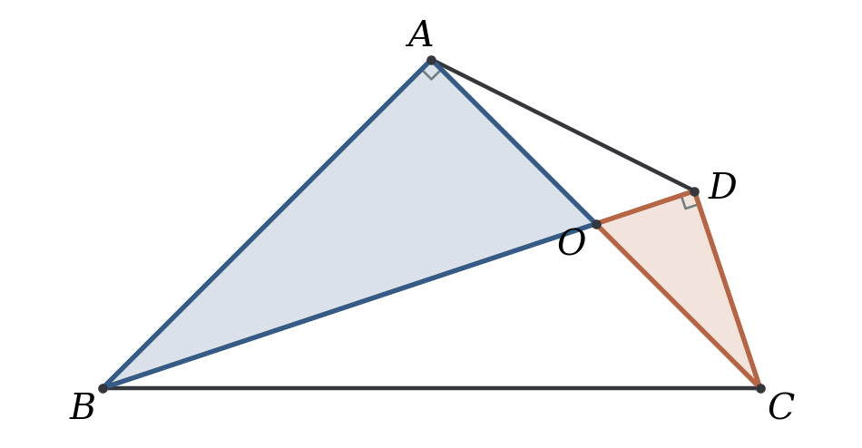

由八字形得

\[
\angle BAC+\angle ABD=\angle BDC+\angle ACD.
\]

因此，∠BAC＝∠BDC 与 ∠ABD＝∠ACD 可以相互推出。图中两个顶角为直角时，就能得到 ∠ABD＝∠ACD。

### 例 1 四个条件，知三推一

按图取定方位：A、D 在 BC 的同侧，AC 与 BD 在内部相交。延长 CD 至 X，连接 AD，DA 位于 ∠BDX 内部。有四个条件：

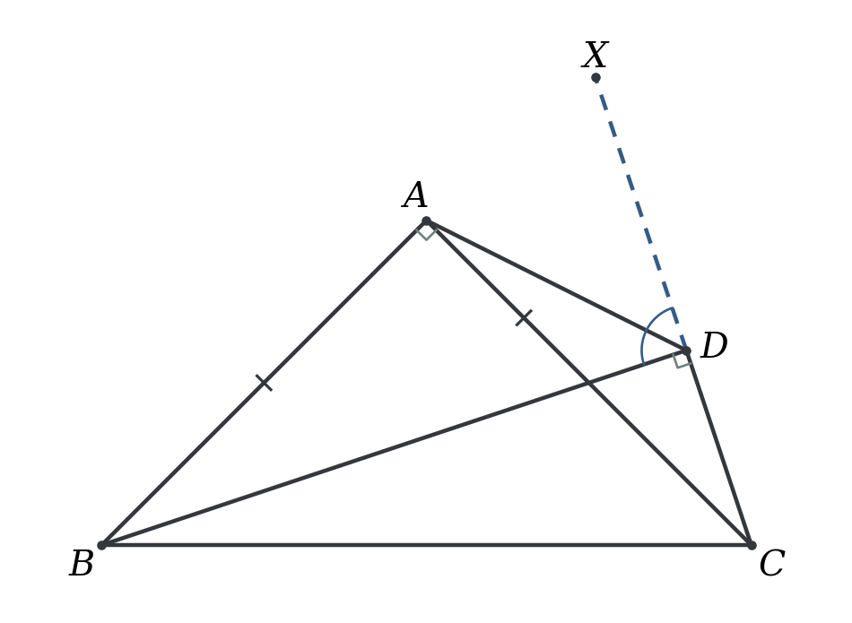

| 条件 | 内容 |
| --- | --- |
| ① | AB＝AC |
| ② | ∠BAC＝90° |
| ③ | ∠BDC＝90° |
| ④ | DA 平分 ∠BDX，即 ∠BDA＝∠ADX |

**知道其中任意三个，就能推出剩下的一个。**

#### （1）$\text{①②③}\Rightarrow\text{④}$：连接直角顶点，得到外角平分线

已知 AB＝AC，∠BAC＝∠BDC＝90°，说明 DA 平分 ∠BDX。

**怎么想**

两个直角先给出 ∠ABD＝∠ACD。接下来有两个方向：从 A 向 BD、CD 作双垂，把斜边 AB、AC 配成直角三角形；或者围绕 A 补出另一个等腰直角三角形，把上一章的手拉手用起来。

由 ∠BAC＝∠BDC，利用八字形倒角，得

\[
\angle ABD=\angle ACD.
\]

**方法一：从 A 作双垂。**

过 A 作 AM⊥BD，垂足为 M；作 AN⊥CD，垂足为 N。本图中 M 在线段 BD 上，N 在 CD 经过 D 的延长线上。

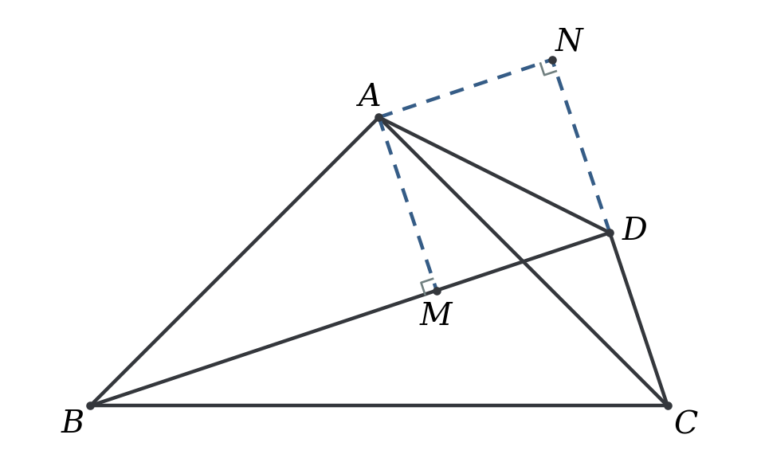

在 Rt△ABM 与 Rt△ACN 中，AB＝AC，∠ABM＝∠ACN，且两垂足处都是直角，故

\[
\triangle ABM\cong\triangle ACN\quad(\mathrm{AAS}),
\qquad AM=AN.
\]

再看 Rt△ADM 与 Rt△ADN：斜边 AD 公共，AM＝AN，所以

\[
\triangle ADM\cong\triangle ADN\quad(\mathrm{HL}).
\]

因此 ∠MDA＝∠NDA，即 ∠BDA＝∠ADX。又因为 ∠BDA＋∠ADX＝90°，所以

\[
\boxed{\angle BDA=\angle ADX=45^\circ.}
\]

**方法二：过 A 添直角，构造手拉手。**

过 A 作 AP⊥AD，交 BD 于 P。

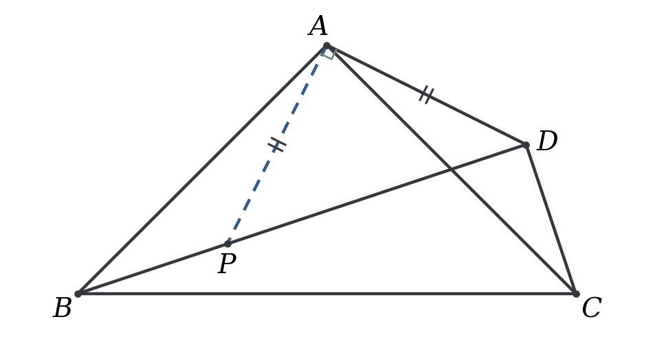

由 AB⊥AC、AP⊥AD，按图有 ∠BAP＝∠CAD；又有 ∠ABP＝∠ACD、AB＝AC，故

\[
\triangle ABP\cong\triangle ACD\quad(\mathrm{ASA}),
\qquad AP=AD.
\]

因此 △APD 为等腰直角三角形，∠PDA＝45°。P 在 DB 上，故 ∠BDA＝45°，∠ADX＝90°－45°＝45°。

也可以先在 BD 上取 P，使 BP＝CD。由 ∠ABP＝∠ACD、AB＝AC，先以 SAS 证明同一组全等，得到 AP＝AD、∠BAP＝∠CAD，再推出 AP⊥AD。两种作法落到同一幅图上：一种先添角，另一种先添边。

**方法点睛**：共斜边先倒角，再把“等腰”转成一组全等；外角平分线由等距离或等腰直角三角形得到。

#### （2）$\text{①②④}\Rightarrow\text{③}$：已知外角平分线，反推 D 处直角

已知 AB＝AC，∠BAC＝90°，DA 平分 ∠BDX，说明 ∠BDC＝90°。

**怎么想**

这次不能先用两个直角倒角，因为 D 处的直角正是待证结论。∠BDA＝∠ADX 能先制造对称：作双垂得到 AM＝AN，或截取等长边制造 SAS 全等。把对称带来的等长再接上 AB＝AC，便能推出 ∠ABD＝∠ACD。

**方法一：作双垂，先用角平分线。**

沿用例 1（1）的 AM、AN。由 ∠BDA＝∠ADX、公共边 AD 和两个直角，得

\[
\triangle ADM\cong\triangle ADN\quad(\mathrm{AAS}),
\qquad AM=AN.
\]

再结合 AB＝AC，以 HL 得 Rt△ABM≅Rt△ACN，所以 ∠ABD＝∠ACD。由八字形倒角，

\[
\angle BDC=\angle BAC=90^\circ.
\]

**方法二：向上延长 CD，截取 DE＝DB。**

延长 CD 至 E，使 DE＝DB，连接 AE。

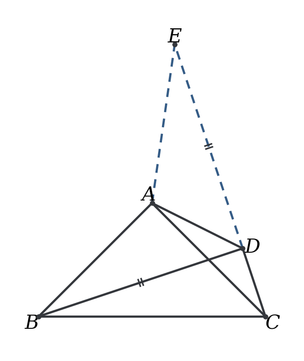

由 ∠BDA＝∠ADE、公共边 AD、DB＝DE，得

\[
\triangle ADB\cong\triangle ADE\quad(\mathrm{SAS}).
\]

所以 AB＝AE，∠ABD＝∠AED。又因为 AB＝AC，所以 AE＝AC，即 ∠AEC＝∠ACE。因此 ∠AEC＝∠ACE＝∠ABD。

最后八字形得 ∠BDC＝90°。

**方法三：向右延长 BD，截取 DF＝DC。**

延长 BD 至 F，使 DF＝DC，连接 AF。

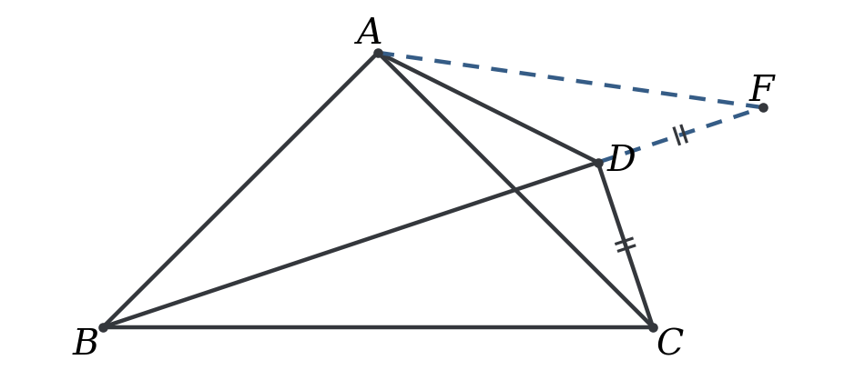

\[
\angle ADF=180^\circ-\angle BDA,
\qquad \angle ADC=180^\circ-\angle ADX.
\]

等角的补角相等，所以 ∠ADF＝∠ADC。结合 AD 公共、DF＝DC，得

\[
\triangle ADF\cong\triangle ADC\quad(\mathrm{SAS}),
\qquad AF=AC,
\quad \angle AFD=\angle ACD.
\]

故 AB＝AC＝AF，从而 ∠ABD＝∠AFD＝∠ACD。最后八字形得 ∠BDC＝90°。

**方法点睛**：已知角平分线，可以先围绕它制造全等或者等腰。

#### （3）$\text{②③④}\Rightarrow\text{①}$：保留两个直角，反推等腰

已知 ∠BAC＝∠BDC＝90°，DA 平分 ∠BDX，说明 AB＝AC。

**怎么想**

两个直角给 ∠ABD＝∠ACD；外角平分线给 AM＝AN。这一次 AB＝AC 是待证结论，全等不能再用 HL。已有两个角和一条直角边，可以改用 AAS。

由 ∠BAC＝∠BDC＝90°，八字形倒角得 ∠ABD＝∠ACD。

从 A 向 BD、CD 作双垂，记垂足为 M、N。由 ∠BDA＝∠ADX，得 Rt△ADM≅Rt△ADN，从而 AM＝AN。

再由 ∠ABM＝∠ACN、两个直角、AM＝AN，得

\[
\triangle ABM\cong\triangle ACN\quad(\mathrm{AAS}),
\qquad AB=AC.
\]

**另外两种对称全等的写法。**

- 按（2）方法二作 E，得到 AB＝AE、∠ABD＝∠AED。由 ∠ABD＝∠ACD，得 ∠AEC＝∠ACE，所以 AE＝AC，进而 AB＝AC。
- 按（2）方法三作 F，得到 AF＝AC、∠AFD＝∠ACD。由 ∠ABD＝∠ACD，得 ∠AFB＝∠ABF，所以 AB＝AF，进而 AB＝AC。

**方法点睛**：条件与结论交换后，要重新选择全等判定；等边待证时，用等角和等距离搭桥。

#### （4）$\text{①③④}\Rightarrow\text{②}$：保留等边，反推 A 处直角

已知 AB＝AC，∠BDC＝90°，DA 平分 ∠BDX，说明 ∠BAC＝90°。

从 A 向 BD、CD 作双垂，垂足分别为 M、N。由 ∠BDA＝∠ADX、AD 公共和两个直角，得 Rt△ADM≅Rt△ADN，所以 AM＝AN。

又 AB＝AC，故

\[
\triangle ABM\cong\triangle ACN\quad(\mathrm{HL}),
\qquad \angle ABD=\angle ACD.
\]

由八字形倒角，得

\[
\angle BAC=\angle BDC=90^\circ.
\]

也可以照例 1（2）的两种延长作法：先由对称全等和 AB＝AC 得到 ∠ABD＝∠ACD，再把已知的 ∠BDC＝90° 换回 ∠BAC＝90°。

**方法点睛**：先清点已知条件；通过等距离与等斜边得到等角，再把直角搬回另一顶点。

#### 单角变式：把④换成 45° 或 135°

##### 变式一：只给 ∠BDA＝45°

已知 AB＝AC，∠BAC＝90°，∠BDA＝45°，说明 ∠BDC＝90°。

**怎么想**

只给 ∠BDA＝45°，还没有给 ∠ADX。此时“到角两边距离相等”不能直接用。应让这个 45° 和新作的直角出现在同一个三角形里，先得到等腰直角三角形，再用手拉手；另一条路是把 B、C 向 AD 作双垂，用 K 型全等搬运两条直角边。

**方法一：过 A 作 AP⊥AD，交 BD 于 P。**

由于 ∠ADP＝45°、∠PAD＝90°，△APD 是等腰直角三角形，故 AP＝AD。

由 AB＝AC、AP＝AD、∠BAP＝∠CAD，得

\[
\triangle ABP\cong\triangle ACD\quad(\mathrm{SAS}).
\]

所以 ∠ABP＝∠ACD，即 ∠ABD＝∠ACD。由八字形倒角，∠BDC＝∠BAC＝90°。

与例 1（1）对照：那里先全等，再证明 AP＝AD；这里先由 45° 得 AP＝AD，再全等。辅助线相同，证明顺序由已知条件决定。

**方法二：从 B、C 向 AD 作双垂。**

过 B 作 BM⊥AD，过 C 作 CN⊥AD，垂足分别为 M、N。构造一线三等角。

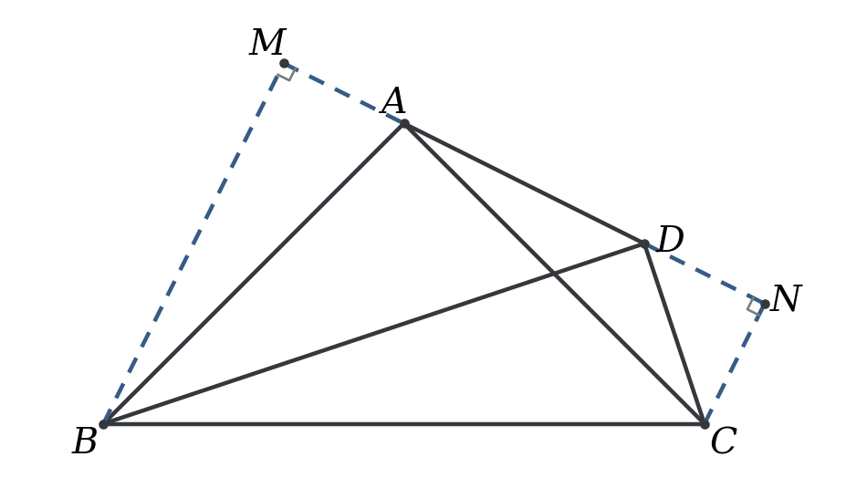

在 Rt△ABM 与 Rt△CAN 中，∠BAM＝∠ACN，AB＝CA，所以

\[
\triangle ABM\cong\triangle CAN\quad(\mathrm{AAS}),
\qquad BM=AN,\quad AM=CN.
\]

由于 ∠BDM＝45°，Rt△BMD 为等腰直角三角形，所以 BM＝DM。于是

\[
AN=DM=AM+AD,
\qquad DN=AN-AD=AM=CN.
\]

故 Rt△CDN 也是等腰直角三角形，∠CDN＝45°。又 ∠BDA＝45°，故 ∠BDC＝180°－45°－45°＝90°。

**方法点睛**：只给单个 45° 时，先补等腰直角三角形；用一线三等角时，等长常藏在“加减公共部分”中。

##### 变式二：换成 ∠ADC＝135°

已知 AB＝AC，∠BAC＝90°，∠ADC＝135°，说明 ∠BDC＝90°。

**怎么想**

∠ADC＝135° 等价于 ∠ADX＝45°。与变式一对照，现在方便补出的是 AD 与 CD 延长线之间的等腰直角三角形。K 型全等也仍可用，只是先得到等腰直角的变成了 △CDN。

**方法一：向上补等腰直角三角形。**

过 A 作 AQ⊥AD，交 CD 经过 D 的延长线于 Q。

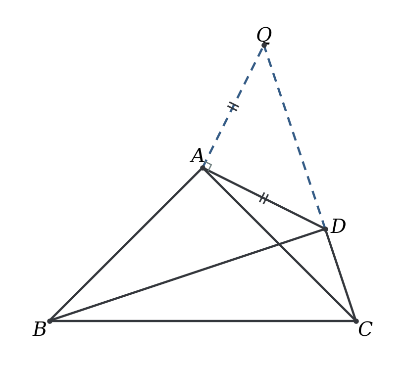

由 ∠ADQ＝180°－135°＝45°，得 AQ＝AD。又 AB＝AC，且由两对垂直关系，按图有 ∠BAD＝∠CAQ，故

\[
\triangle ABD\cong\triangle ACQ\quad(\mathrm{SAS}).
\]

所以 ∠ABD＝∠ACQ＝∠ACD。再倒角得 ∠BDC＝90°。

**方法二：从 B、C 向 AD 作双垂。**

沿用变式一的 K 型图，由 Rt△ABM≅Rt△CAN，有 BM＝AN、AM＝CN。

因为 ∠CDN＝180°－∠CDA＝45°，所以 Rt△CDN 为等腰直角三角形，CN＝DN。于是

\[
AM=DN,
\qquad DM=AM+AD=DN+AD=AN=BM.
\]

故 Rt△BMD 为等腰直角三角形，∠BDA＝45°。已知 ∠ADX＝45°，所以 ∠BDC＝90°。

**方法点睛**：135° 先看邻补角；与 45° 变式比较，交换的是先出现的等腰直角三角形。

### 例 2 角平分线上的二倍关系

如图，在 △ABC 中，∠A＝90°，AB＝AC。BD 平分 ∠ABC，交 AC 于 D。过 C 作 CE⊥BD，交 BD 的延长线于 E。求证：BD＝2CE。

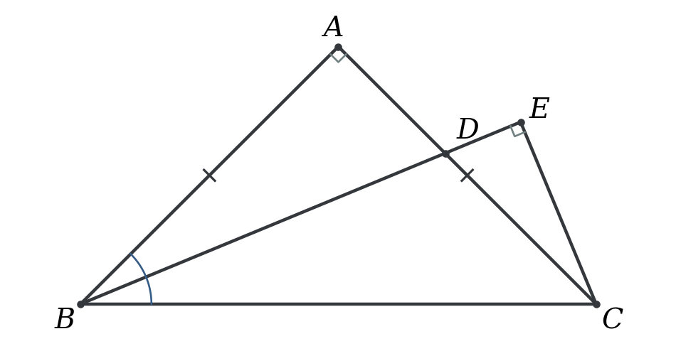

**怎么想**

∠ABC＝∠ACB＝45°，而 BD 平分 ∠ABC，所以 ∠ABD＝∠DBC＝22.5°。目标 BD＝2CE 可以分别拆成四条路线：

1. 延长相交：把 BD 换成一条整段 CF，再用 E 是 CF 的中点。
2. 平行补形：找到 BD 的中点 G，证明 DG＝CE。
3. 手拉手补形：找到 BD 的中点 F，证明 BF＝CE。
4. 补短：先把 CE 补成整段 CF，再证明 CF＝BD。

下面各方法中的 F、G 都独立作出。

**方法一：延长 BA，与 CE 的延长线相交。**

延长 BA、CE，交于 F。

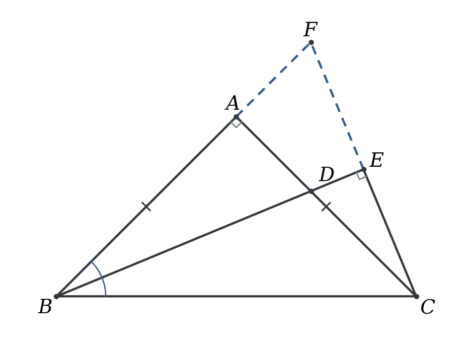

由于 AB⊥AC、BD⊥CF，按图有 ∠ABD＝∠ACF。又 ∠BAD＝∠CAF＝90°、AB＝AC，故

\[
\triangle ABD\cong\triangle ACF\quad(\mathrm{ASA}),
\qquad BD=CF.
\]

在 △BFC 中，∠FBC＝45°，∠FCB＝90°－22.5°＝67.5°，所以 ∠BFC＝67.5°，从而 BF＝BC。

因为 BE⊥FC，在等腰三角形 BFC 中，底边上的高也是中线，故 FE＝EC，CF＝2CE。因此 BD＝2CE。

**方法二：过 D 作平行线，把二倍关系拆成两半。**

过 D 作 DF∥AB，交 BC 于 F；过 F 作 FG⊥BD，垂足为 G。

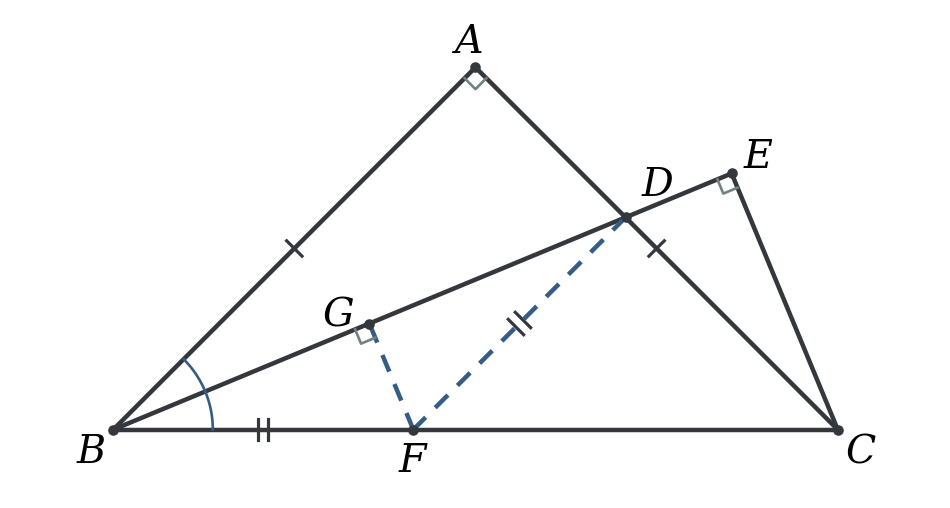

由 DF∥AB、BD 平分 ∠ABC，得 ∠DBF＝∠BDF＝22.5°，所以 BF＝DF。

又 DF⊥DC，∠DCF＝∠ACB＝45°，故 △DCF 是等腰直角三角形，DF＝DC。

在 Rt△BFG 与 Rt△DFG 中，BF＝DF，FG 公共，故两三角形全等，BG＝DG。因此 BD＝2DG。

由于 DF⊥DC、DG⊥CE，按图有 ∠FDG＝∠DCE。结合两个直角、DF＝DC，得

\[
\triangle DFG\cong\triangle CDE\quad(\mathrm{AAS}),
\qquad DG=CE.
\]

故 BD＝2DG＝2CE。

**方法三：在 A 处添直角，补出手拉手。**

过 A 作 AF⊥AE，交 BD 于 F。

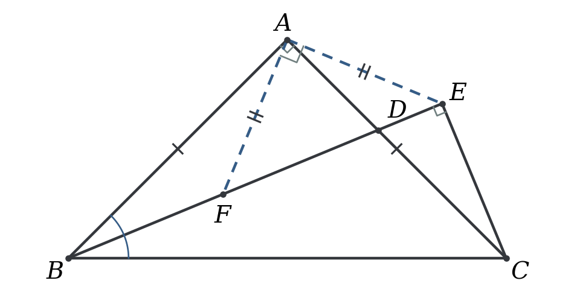

由 AB⊥AC、AF⊥AE，按图有 ∠BAF＝∠CAE。又 ∠ABF＝22.5°，由 AC⊥AB、CE⊥BD，得 ∠ACE＝22.5°。结合 AB＝AC，有

\[
\triangle ABF\cong\triangle ACE\quad(\mathrm{ASA}),
\qquad AF=AE,\quad BF=CE.
\]

所以 △AFE 是等腰直角三角形，∠AFE＝45°。同时 ∠BAF＝∠CAE＝22.5°，因此在 △ABF 中，AF＝BF。

F、D、E 依次共线，所以 ∠AFD＝45°；又 ∠FAD＝90°－22.5°＝67.5°，故 ∠ADF＝67.5°，从而 FD＝AF。

因此 BF＝AF＝FD，F 是 BD 的中点。于是 BD＝2BF＝2CE。

**方法四：先补短，把 CE 倍长。**

延长 CE 至 F，使 EF＝EC，连接 BF。

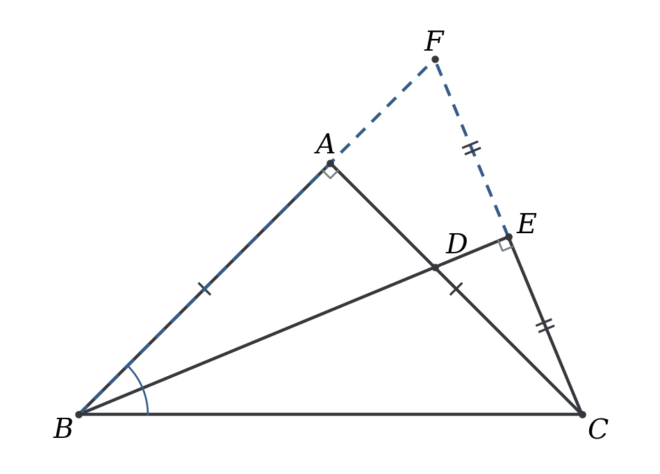

因为 BE⊥CF、CE＝EF、BE 公共，

\[
\triangle BEC\cong\triangle BEF\quad(\mathrm{SAS}).
\]

所以 ∠EBF＝∠EBC＝22.5°。F、C 在 BE 的两侧，故 ∠CBF＝45°＝∠CBA，即 B、A、F 共线，且 F 在 BA 经过 A 的延长线上。

再由 AB＝AC、∠BAD＝∠CAF＝90°、∠ABD＝∠ACF，得 △ABD≅△ACF（ASA），所以 BD＝CF。

又 CF＝CE＋EF＝2CE，故 BD＝2CE。

方法一和方法四最终落到同一个辅助点 F：方法一先通过相交找到它，再证明 CE＝EF；方法四先由 CE＝EF 作出它，再证明 B、A、F 共线。作图顺序不同，关键构型相同。

**方法点睛**：看到“二倍”，先决定是倍长短段，还是平分长段；再用全等把整段或半段换到目标线段上。

### 辅助线总结

| 看见的条件或目标 | 可以先作的线 | 希望得到什么 |
| --- | --- | --- |
| 已知外角平分线 | 从 A 向 BD、CD 作双垂 | 到角两边的距离相等 |
| 外角相等，想造对称全等 | 延长 CD，取 DE＝DB；或延长 BD，取 DF＝DC | SAS 全等，再借等腰换角 |
| 单个 45° 或 135° | 过 A 作 AD 的垂线，交相应边或延长线 | 等腰直角三角形，接手拉手 |
| 等腰直角 ABC，需搬运长度 | 从 B、C 向 AD 作双垂 | K 型全等，直角边交叉对应 |
| 目标为二倍关系 | 倍长短段，或给长段找中点 | 将二倍关系转为整段相等或半段相等 |
| 例 2 的角平分线 | 平行线补等腰；垂线取中点 | 把角平分线条件转成中点与等长 |

两种“双垂”要分清：**A 向 BD、CD 作双垂，是利用角平分线的等距离；B、C 向 AD 作双垂，是利用等腰直角 ABC 的 K 型全等。** 它们的出发点和全等对应顺序都不同。

#### 使用时注意

1. DA 平分的是 ∠BDX，参与比较的两个角是 ∠BDA 与 ∠ADX。
2. 条件与结论交换后，重新检查全等判定。等边待证时不能用它作 HL 条件；直角待证时不能提前用手拉手。
3. K 型全等推出的是 BM＝AN、AM＝CN。写完对应边后，再按点的顺序加减公共部分，不能把同一条垂线上的两段凭图认成相等。
